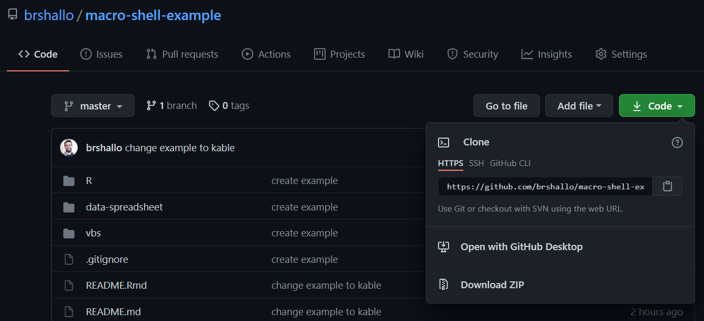

<!-- README.md is generated from README.Rmd. Please edit that file -->

```{r, include = FALSE}
knitr::opts_chunk$set(
  collapse = TRUE,
  comment = "#>",
  warning = FALSE,
  message = FALSE
)
```

# Macros in the Shell... Example

This repo provides the example walk-through for my blog post on [Macros in the Shell: Integrating That Spreadsheet From Finance Into A Data Pipeline](https://www.bryanshalloway.com/2021/05/10/macros-in-the-shell-integrating-that-spreadsheet-from-finance-into-a-local-data-pipeline/). 

Click "Code" to download or clone this repository so that you can go through it on your own machine.



## Example

Let's break down the kinds of pipelines we are talking about in [the post](https://www.bryanshalloway.com/2021/05/10/macros-in-the-shell-integrating-that-spreadsheet-from-finance-into-a-local-data-pipeline/) into steps:

1. [Pipeline Computes Things]
2. [Pipeline Passes Things Through Spreadsheet / Macros]
3. [Pipeline Collects Outputs from Spreadsheet / Macro]

### Pipeline Computes Things

For our simple example, pretend you are evaluating deals for investments. Deals come in batches of projects. Projects can have varying...

* costs (paid in lump sums)
* revenues (received in lump sums)
* years from costs (paid) until revenue (received)

An example deal may look like this:

```{r}
library(tidyverse)

source(here::here("scripts", "funs.R"))

set.seed(1234)
create_deal(12) %>% 
  knitr::kable()
```

Say you fetched and/or predicted these values through a pipeline you or your team set-up. 

For our example, we are just pretending like this happened, the results of which are simulated by the `create_deal()` function whose logic is in "scripts/funs.R" which is called as the first non set-up step in "run-all.R".

### Pipeline Passes Things Through Spreadsheet / Macros

This is where most of the things relevant to the post happen. The attributes for your deal need to be passed as inputs through an excel workbook + VBA macro (maintained by finance or someone other than yourself). The key workbook / macros for this example live in "data-spreadsheet/deal_calculator.xlsm". 

Below, I walk through the steps of the operations, indicating at the start of each line with either {DS} or {FINANCE} for whether setting-up the step would likely be the responsibility of the data scientist or finance:

1. {DS} Deal information is written to a location where the spreadsheet is expecting it 


* This could be a separate .csv, a location within the .xlsm, or as parameters through the VBScript. 
    * In our case the deal "data-spreadsheet/example_deal.csv" is expected to be written to the same folder where "data/deal_calculator.xlsm" lives; 
    * we also pass in a relative file path via the shell script in *step 2* below.
2. {DS/FINANCE} Now that the relevant information from upstream is set: the relevant macros are triggered by a VBScript ("scripts/run_vbs.vbs") --> which is triggered by a shell function --> which is run via an R script ("scripts/run-all.R")
3. {FINANCE} The spreadsheet in our case does the following:

* Updates all connections in the workbook (i.e. whatever is in "data/example_deal.csv") -- via the macro `refresh_data`
* calculate the present value associated with each project on the deal as well as the total value for the deal -- via excel table calculations and excel formulas
* copies total deal value to a new cell (this macro is essentially meaningless, but just an extra macro thrown in for example / testing) -- via `copy_deal_value` macro

*...you could imagine there being some more complicated calculations...*

### Pipeline Collects Outputs from Spreadsheet / Macro

The `readxl::read_excel()` line in "run-all.R" then reads the *total deal value* back into R (owner of the spreadsheet would need to ensure that location this is written to will be consistent). And the data pipeline continues on its way...

## Appendix

### Threads helpful for setting-up VBScript

Setting-up the VB wrapper script was a bit annoying (as was setting-up relative paths and passing in parameters to the VB script). Below are a few threads I found helpful:

* https://techcommunity.microsoft.com/t5/excel/power-query-source-from-relative-paths/m-p/206150
* https://stackoverflow.com/a/15621773/9059865 
* https://stackoverflow.com/questions/20979154/how-to-close-excel-file-from-vbscript-without-being-prompted
